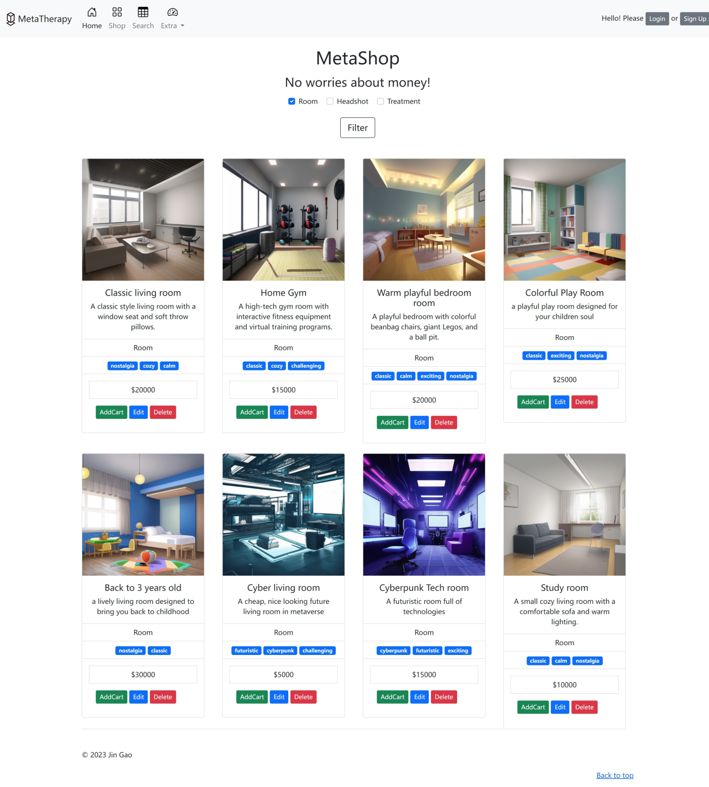

# A3 Design

# **Metaverse Therapy**

### An online platform for drug addiction people to heal through the digital world.

### **Metaverse Therapy**

The **Metaverse Therapy** is an online platform for drug addiction people to heal through the digital world. It is now an online shop for drup addictive people to virtually purchase metaverse rooms, headshots, and treatment plans.

Deployed Website: [https://metatherapy-test.onrender.com](https://metatherapy-test.onrender.com/)
Note: all images, excluding the first hero image in black and white, are all generated with stable-diffusion. All prices are fake and for demonstration purpose.
****

### UX/UI

**Main Page**

Description: The first page is used to show the purpose of this website and guide the user to view the three key categories of the product: Room, headshots and treatment programs. The title image is carousel with fade effect.

**Shop main page:**

This page features product cards that allow users to filter and pick the product they like. It’s more like an admin page, products can be added to carts, edited and delete.

TODO: make it more customer oriented.

**Shop search page**

Customer can search from a set of properties belongs to projects. Each product has its images formatted with the same size.

**Product creation page**

A basic form to create product for administrative purpose.

**User Login Page**

A stylized login page with customized background and greeting texts.

**User Registration Page**

A stylized sign up page follow the style of the login page

**Shopping cart page**

A refined shopping cart page with the ability to show product images, change the quantity and calculate total prices for both each product and the whole cart.

**Checkout with Stripe**

# Website map

## Main Pages:

- Landing Page (Index page)
  - Router: /
  - Description: This is the first impression to the user.

- Shop Page
  - Router: /shop
  - Description: This page allows users to select between different categories.

- About Page
  - Router: /about
  - Description: This page contains author information and GitHub links.

## User related:

- Login Page
  - Router: /user/login
  - Description: This is where the user logs in.
  - Design: Username + Password + Email+ Captcha, auto-generate an user_id

- Register page (Cloudinary API)
  - Router: /user/register
  - Description: This is where a new user can register.
  - Design: Username, Password, Gender, Birthday, Nickname, Image Upload

## Product Listings:

- Headshot Listing Page
  - Router: /shop/headshot
  - Description: Upload your headshot and choose your new identity. Create a series of AI-generated headshots for your semi-digital life.

- Treatment Listing Page
  - Router: /shop/treatment
  - Description: Select from a series of fun drug treatments.

- Room Listing Page
  - Router: /shop/room
  - Description: Choose from a series of rooms specifically designed for you.

## Order Management:

- Shopping Cart Page
  - Router: /shop/cart
  - Description: This page displays a list of selected items.

- Checkout Page (Stripe API)
  - Router: /shop/checkout
  - Description: This page allows you to purchase with your digital currency.

- Order Page
  - Router: /shop/order
  - Description: Manage orders.

## Database Design

### Table: users

| Column Name | Data Type | Key | Note |
| --- | --- | --- | --- |
| user_id | INT | PRIMARY | auto-generated |
| username | VARCHAR(50) | UNIQUE | notNull, length:255 |
| password | VARCHAR(255) |  |  |
| email | VARCHAR(100) | UNIQUE |  |

### Table: categories

| Column Name | Data Type | Key |
| --- | --- | --- |
| category_id | INT | PRIMARY |
| name | VARCHAR(50) | UNIQUE |

### Table: products

| Column Name | Data Type | Key |
| --- | --- | --- |
| id | INT | PRIMARY |
| name | VARCHAR(100) |  |
| description | TEXT |  |
| cost | DECIMAL(10, 2) |  |
| image_url | VARCHAR(200) |  |
| category_id | INT | FOREIGN KEY (Categories.category_id) |
| brand_id | INT | FOREIGN KEY (BRAND NOT IMPLEMENTED YET) |

### Table: products_tags

| Column Name | Data Type | Key |
| --- | --- | --- |
| id | INT | PRIMARY |
| product_id | INT |  |
| category_id | INT | FOREIGN KEY (Categories.category_id) |

### Table: tags

| Column Name | Data Type | Key |
| --- | --- | --- |
| id | INT | PRIMARY |
| name | VARCHAR(100) |  |

### Table: cart_items

| Column Name | Data Type | Key |
| --- | --- | --- |
| id | INT | PRIMARY |
| user_id | INT | FOREIGN KEY (users.user_id) |
| product_id | INT | FOREIGN KEY (Products.product_id) |
| quantity | INT |  |

# Use Cases

1. Users should access the main page to get the core idea of the website and have easy access to shopping pages and user-related functions
2. Users should be able to browse the products smoothly with proper information, format, and images. They are able to record their selection using the shopping cart function.
3. Users should be able to easily change the products they what to buy, including total quantity, and the items.
4. Users should be able to check out and pay.
5. The website admin should be able to manage new products, input information including images to the database. They should also be able to manage the products by changing the price and remove some products.

# Technologies Used

Bootstrap 5.0.2, Express, Handlebars, Wax, Knex, Bookshelf, Forms, Cloudinary, Stripe, Flash, MySQL, PostgreSQL, Render.com, GitPod, GitHub desktop

# Testing

### Test Cases

If you wish to present your testing steps in a clearer method, consider writing *test cases*. A test case consists of the following structure:

| Test Case # | Test Case Description | Test Steps | Expected Result |
| --- | --- | --- | --- |
| 1 | Access Main Page | 1) Enter http://localhost:3000/ or deployed link| The home page successfully loaded with images displayed |
| 2 | Jump to product section | 1) in main page, click the “Main Products” button| The page should scroll down to the beginning of Rooms section  |
| 3 | Access shop | 1) click Shop icon in the navbar | The item cards with images will be shown, together with buttons to edit/remove/add to cart |
| 4 | Search Products | 1) click Search icon in the navbar 2) select tags, enter names, enter price ranges, and hit Search button | A list of filtered products should show up |
| 5 | Create Products | 1) From Navbar - Extra - Add Productm2) Enter product information 3) Hit Submit New Product | The success message should be shown |
| 6 | Upload images | 1) From Navbar - Extra - Add Product 2) Enter product information 3) Hit Upload Product Image 4) Submit New Product | The link to the product image should be included in the database The images should be shown in other pages |
| 7 | Update Products | 1) In Shop page, select one product and click edit 2) Enter new product information 3) Hit Submit | The success message should be shown |
| 8 | Remove Products | 1) In Shop page, select one product and click remove | The success message should be shown |
| 9 | User Register | 1) In navbar, click sign up button 2) enter related information 3) hit  | The success message should be shownThe users should be able to login |
| 10 | User Login | 1) In navbar, click login button 2) enter correct user info 3) hit login | The success message should be shown The users should be able to login |
| 11 | User Logout | 1) In navbar, click logout button | The success message should be shown |
| 12 | Add item to shopping cart | 1) In Shop page, select one product and click AddCart Button 2) click the Cart button | The items should be included in the shopping cart |
| 13 | Remove item in shopping cart | 1) In Shopping cart page, select one product and click Remove Button | The success message should be shown. The product should be removed from the shopping cart |
| 14 | Edit Quantity | 1) In Shopping cart page, select one product and edit the quantity 2) click update quantity button | The quantity should be updated, and the total price should be updated accordingly |
| 15 | Mobile Responsiveness | 1) Use developer mode to test the behavior of navbar and content layouts | The navbar should shrink to a hamburger icon The cards should be arranged into a list of one row |

## Known Bugs
1. Price formatting should divide by 100
2. Site logo have issue shown in other pages than the home page
3. The filter function in shop page can't work
4. The category text in the shop page is not able to fetch the ones from database

## Todo
1. add more item catagories
2. add administration identity other than users
3. add more columns to the database and reflects to the items

# Deployment

**Hosting platform:** [render.com](http://render.com) for both database and web application

**Environment variables: .env files**

## Dependencies

- `express`
- `hbs`
- `wax-on`
- `dotenv`
- `knex`
- `bookshelf`
- `forms`
- `express-session`
- `session-file-store`
- `connect-flash`
- `cloudinary`
- `csurf`
- `stripe`
- `jsonwebtoken`

# Credits

Bootstrap 5.0.2: [https://getbootstrap.com/docs/5.3/getting-started/introduction/](https://getbootstrap.com/docs/5.3/getting-started/introduction/)

Bootstrap examples: [https://getbootstrap.com/docs/5.3/examples/](https://getbootstrap.com/docs/5.3/examples/)   

Referenced examples: [Carousel](https://getbootstrap.com/docs/5.3/examples/carousel/), Navbars, Product

Login page reference: [https://mdbootstrap.com/docs/standard/extended/login/](https://mdbootstrap.com/docs/standard/extended/login/)  

Template name: Registration page

Framework codes reference: [https://github.com/kunxin-chor/dwad20-framework](https://github.com/kunxin-chor/dwad20-framework)